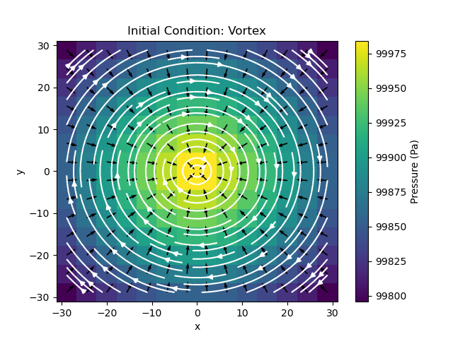

# CMSE 822: Parallel Computing Final Project

# REPORT

## Department of Computational Mathematics, Science and Engineering
### Ian Freeman
### Michigan State University

## Introduction

The Navier-Stokes equations are a set of differential equations which describe the flow of fluid through operators acting on velocity fields. The equations were developed progressively between the early 1820s through 1850 between French Physicist Claude-Louis Navier and Irish physicist George Stokes. Their work was foundational in the fields of fluid dynamics, and applicable to all fluid flows, including weather patterns, ocean currents, and even magnetohydrodynamics [1]. The full Navier-Stokes equations model the flow of compressible fluids, with dynamic densities, pressure fields, and constantly changing velocity fields. Proving the existence and smoothness of analytical solutions to the full set of equations is one of the seven Millenium problems, and its solution is literally worth a million dollars. While a general solution to the full Navier-Stokes equations have remained elusive, the field of computational fluid dynamics has proven quite successful at finding numerical solutions to the Navier-Stokes equations [1].

In this project, I produced a computational model to the incompressible Navier-Stokes equations. While the model is physically simpler than the full equations, it proved difficult to implement serially, and even more difficult to parallelize. This project focuses on an upwind finite difference method solution of the equations, with semi-physical initial conditions and zero-gradient boundary conditions. The code was written in C++, with plotting schemes and initial condition generators written in python scripts (all in folder 'project_files'). The code was parallelized with both OpenMP and MPI implementations, which dramatically increased performance. The parallelized code was verified, by cross-referencing the serial and parallel output, and no difference was found.

## Methods
### *2D Incompressible Navier-Stokes Equations*

For a 2-dimensional fluid described by velocity vector $\textbf{u} = u \hat{\textbf{x}} + v \hat{\textbf{y}}$, density $\rho$, absolute viscosity $\mu$, and background pressure (spatially varying) $p(x,y)$ under the presence of an external field $\textbf{g}=g_x\hat{\textbf{x}} + g_y\hat{\textbf{y}}$, the incompressible Navier-Stokes equations are listed below [2].

1. **Continuity equation:**
   $$\frac{\partial u}{\partial x} + \frac{\partial v}{\partial y} = 0$$
   
2. **Momentum equations:**
   $$\frac{\partial u}{\partial t} + u \frac{\partial u}{\partial x} + v \frac{\partial u}{\partial y} = -\frac{1}{\rho} \frac{\partial p}{\partial x} + \nu \left(\frac{\partial^2 u}{\partial x^2} + \frac{\partial^2 u}{\partial y^2}\right)$$
   $$\frac{\partial v}{\partial t} + u \frac{\partial v}{\partial x} + v \frac{\partial v}{\partial y} = -\frac{1}{\rho} \frac{\partial p}{\partial y} + \nu \left(\frac{\partial^2 v}{\partial x^2} + \frac{\partial^2 v}{\partial y^2}\right)$$

The $1/Re$ term represents the 'Reynold's number,' a dimensionless constant that represents how 'behaved' the flow is. Large Reynold's numbers indicate turbulent flow, and small Reynold's numbers indicate laminar flow. Typical Reynold's numbers for the simulations described in this project are very high, often reaching scales as large as $10^7$. This is because the simulation domains in this project are large, with high velocities. The Reynold's number is calculated locally at each time step, and $L$ is treated as the geometric mean of the full x and y domain lengths. Many of the simulations have $L=40$, with velocities reaching $10^2$ at simulation edges. The Reynolds number is calculated as:

$$Re=\frac{\rho |\textbf{u}| L}{\mu}$$

### *Physical Parameters, Boundary conditions, and external fields*
This project was meant to simulate water flow in a variety of different conditions. For this reason, the density of all fluids in the resulting simulations are held at a constant $\rho=1000kg/m^3$, and the absolute (dynamic) viscosity is always $\mu=10^{-3}Pas$ (*all units in this project are SI*). These constants are properties of water at $20^oC$. Because the Navier-Stokes equations model ideal fluid flow, properties unique to water (namely surface tension) are disregarded [3]. For simplicity's sake, all the boundaries were treated equally with zero-gradient conditions. That is, for a domain described by $\textbf{r}\in[x_{min}, x_{max}]\times[y_{min}, y_{max}]$, each boundary was subject to:

$$\frac{\partial u}{\partial x}|{xmin, xmax} = \frac{\partial u}{\partial y}|{ymin, ymax} = 0$$

$$\frac{\partial v}{\partial x}|{xmin, xmax} = \frac{\partial v}{\partial y}|{xmin, xmax} = 0$$

This is true for all simulations in this project. Physically, this boundary condition indicates that the simulation domain is a small part of a larger body of water. This is implemented in the code by filling the ghost regions with copies of the nearest velocity values. This ensures the domain's edges are 'flat.' Other boundary conditions could be considered in the future, for example no-slip conditions (velocity perpendicular to surfaces is always 0), reflecting boundaries (the ghost regions are filled with 'mirror images' of neighboring cells, making the derivatives equal and opposite), or Dirichlet conditions (velocities at the boundaries are constant). While these other types of boundary conditions are interesting, the focus of this project is on parallel performance. Additionally, external forces are applied to many of the simulations. These are treated as constant background forces like gravity, or a 'constant wind' which shifts flow preferentially in one direction. These are static background fields that always act on the fluid flow. A time-dependent scheme could be implemented to drive turbulence, or perturb the fluid in numerous ways, but for simplicity, these time-dependent external forces were omitted from this project.

### *Finite Difference Stencil*
The incompressible Navier-Stokes equations are vector equations, so it is natural to use an upwind Finite difference stencil. Let $w_k$ represent the value of a field at spatial cell center $z_k$ with uniform cell width $\Delta z$. The three-point, second-order accurate, one-sided stencils of first and second derivatives are: 

$$ (\frac{\partial w}{\partial z})_{p} = \frac{1}{2 \Delta z} (3w_k - 4w_{k-1} + w_{k-2}) $$

$$ (\frac{\partial w}{\partial z})_{n}=-\frac{1}{2 \Delta z} (3w_k - 4w_{k+1} + w_{k+2}) $$

$$ (\frac{\partial^2w}{\partial z^2})_{p}=\frac{1}{\Delta z^2} (w_k - 2w_{k-1} + w_{k-2}) $$

$$ (\frac{\partial^2w}{\partial z^2})_{n}=\frac{1}{\Delta z^2} (w_k - 2w_{k+1} + w_{k+2}) $$

Upwind schemes require one-sided stencils. In theory, they stabilize the simulation in time, because 'information' travels along with velocity, and no 'information' from far upwind can reach any individual active cell. More specifically, if $w_k>0$, the positive stencils are used, and if $w_k<0$ the negative stencils are used. The above four equations can be described by two with the introduction of a new variable, $s=sgn(w_k)$. Note that these stencils are described here in 1D, but all fields and derivatives are 2D. Inside any individual cell, there are two signs calculated, one for the sign of velocity field in each Cartesian direction. This is especially important in simulations where vortices occur.

$$0 = (\frac{\partial w}{\partial z})_k = \frac{s}{2 \Delta z} (3w_k-4w_{k-s}+w_{k-2s})$$

$$0 = (\frac{\partial^2w}{\partial z^2})_k = \frac{1}{\Delta z^2} (w_k-2w_{k-s}+w_{k-2s})$$

The incompressible Navier-Stokes equations are comprised of six terms. A time-dependent derivative, and five spatial derivatives. Each field $u$ and $v$ are updated via a simple linear timing update of $u_{n+1}=u_n + \Delta t (\text{stencil})$. Numerically, this is an unstable updating scheme. However, for small $\Delta t$, the results remain physical for long enough to perform the parallelization performance studies. The time step $\Delta t$ is also carefully chosen to satisfy the Courant-Friedrichs-Lewy condition [5]. In the code, each of the five spatial derivatives are stored in variables then summed over for the final update. This was done with OpenMP's implementation in mind, as each thread needs to privatize these terms to prevent unintentional communication between processes. 

### *Domain Decomposition & Parallel Implementation*
Common 2D parallel computational fluid dynamics implementations utilize grid-based decomposition, where the active region is decomposed along two axes, creating 'boxes' of active regions in each processor. The processors then have to communicate along both 'x' and 'y' directions. This project used a 'slice' method, outlined in detail in [4]. All implementations (serial, OpenMP, and MPI) discretize the domain into `Nx` and `Ny` points with two (`NG`) extra "guard" or "ghost" cells along the four edges of the domain. The OpenMP and Serial codes need to do no more work, because the entire domain is in shared memory. All cells of the domain can always access all other points of the domain, so no extra care needed to be taken for domain decomposition.

For the MPI implementation, the domain must be split evenly among processors, because MPI assumes distributed memory between different ranks. For `N` MPI ranks, the domain was sliced along the x-axis into `N` evenly split pieces, with each region having `Ny_local = Ny/N` cells in the y-direction (confusingly, in the code `Nx` represents the `i`-axis of the matrices--this convention is omitted from this report for clarity). After boundary conditions are applied at the 'ends' of each rank's active region, the first and last rank (top and bottom) update their boundary conditions. For an arbitrary region on rank `n`, the top two cells must be communicated to the previous rank `n-1` to become the lower ghost cells for that processor's local stencil calculation. Similarly, `n` must communicate its bottom two rows to rank `n+1` to become the upper ghost cells for that processor's local stencil calculation. This is true for all processors, except ranks `0` and `N`, as their upper and lower (respectively) ghost cells are dictated by the boundary conditions.

<figure>
    
</figure>

This swapping of ghost cells between processors is called a 'halo swap' or 'halo exchange.' A schematic of this 'halo swap' is detailed in the schematic above. 
 - Cells colored white or light blue are 'active regions' which will be updated by the stencil
 - Cells colored light blue are active cells that will be communicated to neighboring processes 
 - Cells colored green are ghost zones updated by boundary conditions
 - Cells colored dark blue are ghost zones updated by neighboring active regions
 - Cells colored black are 'dead cells' which are updated through boundary conditions or halo exchanges, but never reached by the stencil

Each row shows the information stored on each MPI rank from rank 0 (top) to rank N (bottom). Shown on the left side is an arbitrary region away from vertical simulation boundaries, indicating the regions shared by the halo exchange. For `Ny_local > 4`, the centers of these regions would be active and white, only updated locally and never shared between ranks. Shown on the right are the right side of the domain after the halo exchange takes place. The active and white cells are updated by the stencil, while the blue ghost cells are only there in case the upwind scheme needs to reach into the neighboring active region's domain.

## Results
### *Verification Test*

The serial code, and parallelized OpenMP and MPI codes (henceforth referred to as `serial`, `OMP`, and `MPI`, respectively) all output identical results. Generally speaking, Finite Difference Stencils are deterministic, and the only differences between processors and implementations would be floating point precision artifacts. Therefore, only one initial condition is needed to verify that all three implementations are equivalent. Furthermore, only one set of initial conditions is needed to complete a performance study. For this project, the initial condition called `vortex` will serve as the initial condition on which this analysis will be constructed.

`vortex` sets the domain to be a $40m$ by $40m$ grid, with varying number of cells along each direction. The initial velocity fields are defined to be a clockwise vortex, centered around the origin, with magnitudes of the velocity scaling as $r^{1/2}$. An external field points radially in with a uniform force of $0.1N$. The background pressure is set to $1atm$, subtracting off the kinetic energy density $\rho |\textbf{u}|^2/2$ of the fluid. Without the external force field, the vortex would spin indefinitely, until the diffusive nature of upwind schemes or the numerical instability of the time-stepping scheme changed the flow.

<figure>
    
</figure>

This initial condition is radially uniform, but numerical noise drives inward flow from the y-axis, which pinches the center together and drives two smaller vortices outward in the positive and negative x-directions. Uniquely, this always happens in the y-axis, never the x-axis. Further investigation is needed to explore why this is the case. Below is a time series plot of `serial` and `MPI` with size 4, run on a 500x500 grid.

<figure>
    
</figure>

The horizontal lines show the parallelized domain in `MPI`. The outputs are identical, as emphasized by the difference plot between the $u$ and $v$ velocities shown on the right. The colorful backgrounds are generated from the post-processed Reynolds numbers, which are uniformly flat. `OMP` also generates these same plots for all thread counts, but these plots are omitted for brevity. Further inspection of the data indicates no difference in outputs, up to machine precision. This noise is not present in the figure above because the I/O operations of all three codes truncate the double precision values to 5 decimal places, for the sake of data storage.

Qualitatively, these simulations act as expected, and seem physical and stable. Quantitatively, When summing the total difference between the u and v fields of `MPI`, `serial`, and `OMP`, is also on order machine precision. This order of stability is more than enough evidence to support the verification that all three simulations are identical.

### *Code Timing, Speedup Analysis, Load Balancing*

Recall the definition of `Ny_local = Ny/N`. This requires that all ranks recieve the same number of rows in the simulation domain. While a simple load-balancing method, the actual stencil implementation proved much more difficult than initially expected. Hence, each processor (or thread) receives equal parts of the domain, which implicitly imposes `Ny` is wholly divisible by `N`.

Consider a hypothetical simulation in which `Ny_local = 1` and `Nx=1`. Inside this single active cell, calculating the updates for a single cell requires 9 floating point operations (FLOPs) per derivative, for 10 total spatial derivatives, 16 FLOPs to combine the above terms, and 9 FLOPs to calculate the Reynolds number. In computation alone, this small theoretical simulation domain would require 115 FLOPs, and only 4 floating point communications per time step. This is not including the many memory accesses for each of these updates, which are always at least 5 (assuming both $u$ and $v$ are positive, only 5 total memory accesses take place). For this reason, the time taken for local computation and memory access always dominates over communication time between processes.

For the actual simulations in this project `Nx` is at minimum 250, to allow for sufficient thread counts or MPI sizes in the speedup analysis. With this large of a domain, we expect ideal speedup graphs. For MPI, this is achieved, with near perfect ideal speedup until the domain reaches `Nx=1000` or `Nx=2000`. For this large of a domain, each MPI message is roughly 8 or 16kb, which is sufficiently large enough to see a dip in performance.

<figure>
    
</figure>

`MPI`'s implementation clearly indicates strong scaling, as with increased processor count yields linearly increasing performance. `OMP`'s speedup is not as significant, or nearly as ideal. The same speedup tests as above were also completed for `OMP`, and at maximum a speedup factor of 3 was observed.

<figure>
    
</figure>

There are a number of reasons that might explain this lackluster performance by OpenMP:

 - Since OpenMP uses **shared memory**, the threads might be hitting a bandwidth limit on the CPU socket. This is not a problem with `MPI`, because it implicitly assumes distributed memory. Additionally, the threads might be trying to access different parts of the same cache line, running into 'false sharing.' The implementation in `OMP` attempted to prevent this issue by privatizing all variables except shared, but if the threads are attempting to access the same cache line this issue could persist despite private variables.
 - OpenMP has non-negligble overhead in its **thread management**. While this is unlikely the cause of the poor performance, it could be contributing to the issues.
 - All communication in `MPI` is done through non-blocking sends and receives. OpenMP does not allow for fine-tune control over communication schemes, and the threads are likely communicating through **blocking communication**, or blocking synchronization.
 - The implemented **timing scheme** for `MPI` does not include any communication. It is not possible to isolate `OMP`'s communication scheme within the current implementation, so the speedup graphs include `OMP`'s distribution, communication, and synchronization, unlike `MPI`'s timing. While this is likely a contributing factor, for any two simulations started simultaneously on the same computer architecture, `MPI` always finishes compiling, running, and finalizing before `OMP`.

Any one of the problems listed above could be the sole source of `OMP`'s poor performance, but it is likely some combination. However, OpenMP is known to scale poorly for large tasks like this, so while these results are not ideal, they are to be expected. Listed below are the exact OpenMP flags in `OMP`'s implementation. No combinations of schedulers, collapse statements, and even permutations of for loops improved the performance described above.

```c
   // Boundary conditions:
   #pragma omp parallel for
        for (int j=0; j<Ny+2*NG; j++) {
            for (int i=0; i<NG; i++) {
               ...
   
   // Main stencil loop:
   #pragma omp parallel for collapse(2) schedule(dynamic) shared(u, v, u_new, v_new, rho, <simulation_parameters>) default(none) private(Re, <derivate_terms>, sx, sy)
        for (int j=NG; j<Ny+NG; j++){
            for (int i=NG; i<Nx+NG; i++){
               ...
```

## Conclusion

In summary, this project highlights an upwind finite difference implementation of the incompressible Navier-Stokes equations. The simulations yield qualitatively physical results, while different parallelization schemes are quantitatively identical. MPI's implementation shows strong-scaling, while OpenMP's implementation exemplifies weak scaling. Despite the lackluster performance by OpenMP, MPI's parallelization exceeded all expectations of performance. It is well known that finite difference stencils can be parallelized through domain decomposition, and this project is no different. 

I have outlined below how I believe this report, implementation, and project repository satisfy the following requirements:
 - *Different parallelization schemes*: This project utilized MPI and OpenMP in its solution of the Navier-Stokes equations
 - *Parallelization strategies*: MPI's implementation was based on domain decomposition, and OpenMP's implementation was task-based
 - *Verification tests*: when using the serial code as a reference, both OpenMP and MPI are numerically identical
 - *Load Balancing*: Implicit limitations on the rank count are imposed to ensure balanced loads
 - *Memory Usage*: See the section titled Code Timing, Speedup Analysis, Load Balancing
 - *Scaling Studies*: See above for speedup and scaling study

## References

[1] Wikipedia, Navier-Stokes Equations. Wikimedia Foundation, 21 Apr. 2024, https://en.wikipedia.org/wiki/Navier-Stokes_equations

[2] Griebel, M., Dornseifer, T. and Neunhoeffer, T. (1997) NumericalSimulation in Fluid Dynamics. Philadelphia, PA: SIAM.

[3] Wikipedia, Water (data page). Wikimedia Foundation, 21 Apr. 2024, https://en.wikipedia.org/wiki/Water_(data_page)

[4] William Gropp, Strategies for Parallelism and Halo Exchange. University of Illinois, Lecture Series 25, https://wgropp.cs.illinois.edu/courses/cs598-s16/lectures/lecture25.pdf

[5] Wikipedia, Courant-Friedrichs-Lewy Condition, Wikimedia Foundation, 21 Apr. 2024, https://en.wikipedia.org/wiki/Courant%E2%80%93Friedrichs%E2%80%93Lewy_condition

[6] Oracle, What Is False Sharing?, Sun Studio 12: OpenMP API User's Guide, 21 Apr, 2024, https://docs.oracle.com/cd/E19205-01/819-5270/aewcy/index.html
